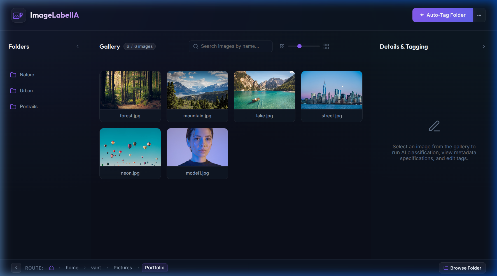
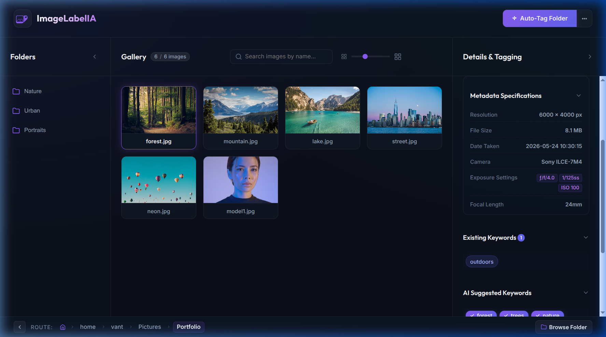
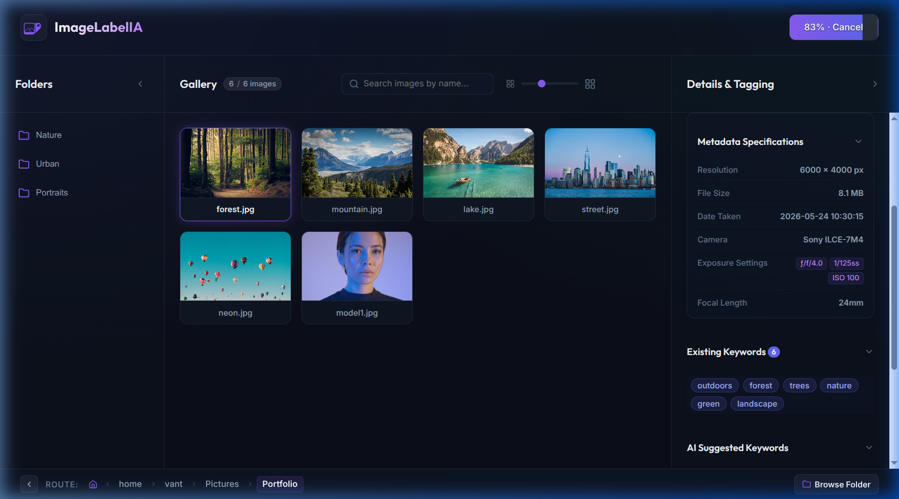
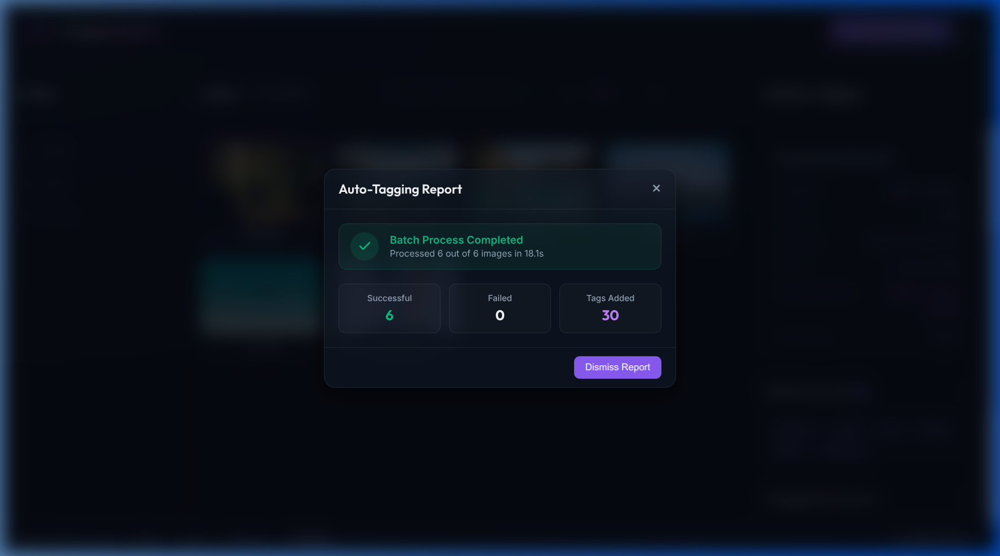

# 📸 Image Label IA

[](https://github.com/lakescorp/ImageLabelIA/actions)
[](LICENSE)
[](https://tauri.app/)
[](https://angular.dev/)
[](https://www.python.org/)

**Image Label IA** is a high-performance desktop application designed specifically for photographers. It automates image tagging and metadata generation using state-of-the-art machine learning models (ConvNeXt and DETR), run directly on your local device via Tauri, Angular, and Rust/Python.

---

## 📖 Table of Contents
- [About the Project](#-about-the-project)
- [Key Features](#-key-features)
- [Tech Stack](#-tech-stack)
- [Prerequisites](#%EF%B8%8F-prerequisites)
- [Installation & Setup](#-installation--setup)
- [Configuration](#%EF%B8%8F-configuration)
- [Usage](#-usage)
- [Developer Guides](#-developer-guides)
- [Contributing](#-contributing)
- [Security](#-security)
- [License](#-license)

---

## 🎨 About the Project

Photographers often spend hours manually keywording, organizing, and tagging photos. **Image Label IA** solves this by performing locally run AI-assisted classification and object detection. By leveraging ONNX Runtime in Rust (`ort`), the application analyzes images instantly and updates metadata using standard EXIF/IPTC/XMP headers, without sending your private photographs to third-party cloud services.

### Application Screenshots

| Main Dashboard | Image Details & AI Tags |
|:---:|:---:|
|  |  |

| Batch Processing | Run Completion Report |
|:---:|:---:|
|  |  |

---

## ✨ Key Features

- **🚀 Hybrid Desktop Architecture**: Powered by Tauri v2 and Angular 20 for a lightweight, secure, and beautiful user interface.
- **🤖 Offline Local AI Inference**: Runs `ConvNeXt` for image classification and `DETR` for object detection offline via ONNX Runtime (`ort` in Rust).
- **⚡ Advanced Gallery UX**: Smooth progressive thumbnail rendering with lazy loading and a thread-concurrency decoder cache to prevent interface lag.
- **📁 Workspace Persistence**: Remembers your last-viewed directory and restores the navigation path seamlessly on relaunch.
- **🗂️ Collapsible Panels**: Toggleable left and right sidebars (Folder Tree and Metadata details) to maximize photo viewing estate.
- **🏷 Metadata Synchronization**: Automatically writes confirmed AI keyword labels back to image standard IPTC headers.
- **⚙️ Configurable AI Confidence**: Adjust confidence thresholds in the batch config modal to fine-tune auto-tag matching.

---

## 🛠 Tech Stack

- **Frontend**: Angular 20, TypeScript, Vanilla CSS
- **App Wrapper & Core**: Tauri v2 (Rust)
- **AI Inference Backend**: Rust `ort` (ONNX Runtime wrapper)
- **Model Processing Scripts**: Python 3 (using `torch`, `transformers`, `huggingface-hub`)
- **Metadata Management**: `rexiv2` (GExiv2 wrapper)

---

## ⚙️ Prerequisites

Before you begin, ensure you have the following installed on your developer machine:

1. **Rust Toolchain**: Install `rustup` to manage Rust compiler versions.
   ```bash
   curl --proto '=https' --tlsv1.2 -sSf https://sh.rustup.rs | sh
   ```
2. **Node.js**: Long-Term Support (LTS) version (v18 or higher recommended).
3. **pnpm**: Fast, disk-efficient package manager.
   ```bash
   npm install -g pnpm
   ```
4. **Python 3.9+**: For running model conversion/download scripts.
5. **System Dependencies** (Linux only):
   Tauri and `rexiv2` (exiv2) require system packages. On Debian/Ubuntu:
   ```bash
   sudo apt-get update
   sudo apt-get install -y libglib2.0-dev libgexiv2-dev libwebkit2gtk-4.1-dev build-essential curl wget file libxdo-dev libssl-dev libayatana-appindicator3-dev librsvg2-dev
   ```

---

## 🚀 Installation & Setup

Follow these steps to clone the repository and set up your local development environment:

### 1. Clone the Repository
```bash
git clone https://github.com/lakescorp/ImageLabelIA.git
cd ImageLabelIA
```

### 2. Install Node Dependencies
Use `pnpm` to install frontend packages:
```bash
pnpm install
```

### 3. Setup Python Virtual Environment & Install Scripts
Create a virtual environment and install dependencies to fetch/convert the ONNX models:
```bash
python3 -m venv .venv
source .venv/bin/activate
pip install -r requirements.txt  # Or manually: pip install huggingface-hub torch transformers
```

### 4. Fetch the ONNX Model
Run the download script to retrieve the pre-converted ConvNeXt model and label set from HuggingFace Hub:
```bash
python download_model.py
```
This saves:
- `src-tauri/resources/convnext.onnx`
- `src-tauri/resources/convnext_labels.json`

### 5. Launch the Application in Dev Mode
Start the Angular dev server and launch the Tauri window:
```bash
pnpm tauri dev
```

---

## ⚙️ Configuration

The application reads configurations from environment variables.
1. Copy the environment template:
   ```bash
   cp .env.example .env
   ```
2. Customize the settings inside `.env` to suit your system requirements (e.g. changing inference execution providers from `cpu` to `cuda`). Refer to [.env.example](file:///.env.example) for detailed comments.

---

## 📸 Usage

Once the application is running:

1. **Select Folder**: Click **"Process Folder"** to open a native directory picker and select your photo directory.
2. **Configure Settings**: Select the desired confidence thresholds and tag processing options in the sidebar.
3. **Run AI Engine**: Click **"Start Tagging"**. The UI will display a real-time progress bar.
4. **Accept / Reject Tags**: Click thumbnails to inspect labels. Confirm or modify tags before applying them to IPTC metadata.
5. **Save to Disk**: Apply suggestions to write metadata tags directly into image files.

---

## 🛠 Developer Guides

### Project Structure
```text
├── .github/                 # GitHub CI/CD workflows, Pull Request & Issue Templates
├── .vscode/                 # IDE Configuration
├── src/                     # Angular Single Page App (Frontend)
│   ├── app/                 # Components and routing
│   └── assets/              # App static files
├── src-tauri/               # Rust Tauri Core (Backend)
│   ├── resources/           # Pre-compiled ONNX models and category tags
│   ├── src/                 # Main Tauri entry point, file system, and inference logic
│   └── Cargo.toml           # Rust Cargo dependencies
├── download_model.py        # Helper script to pull models from HF Hub
├── package.json             # NPM package definitions
└── README.md                # This file
```

---

## 🤝 Contributing

Contributions make the open-source community an amazing place to learn, inspire, and create. Please check out [CONTRIBUTING.md](file:///CONTRIBUTING.md) to understand our branching strategy, linting guidelines, and code submission protocols.

---

## 🔒 Security

For reporting security vulnerabilities or issues regarding data leaks, please consult our [SECURITY.md](file:///SECURITY.md). Please do not open public GitHub issues for security reports.

---

## 📜 License

Distributed under the **MIT License**. See [LICENSE](file:///LICENSE) for more details.
